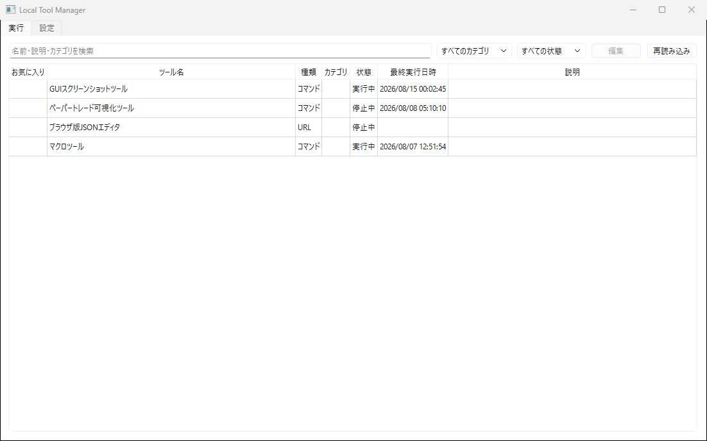
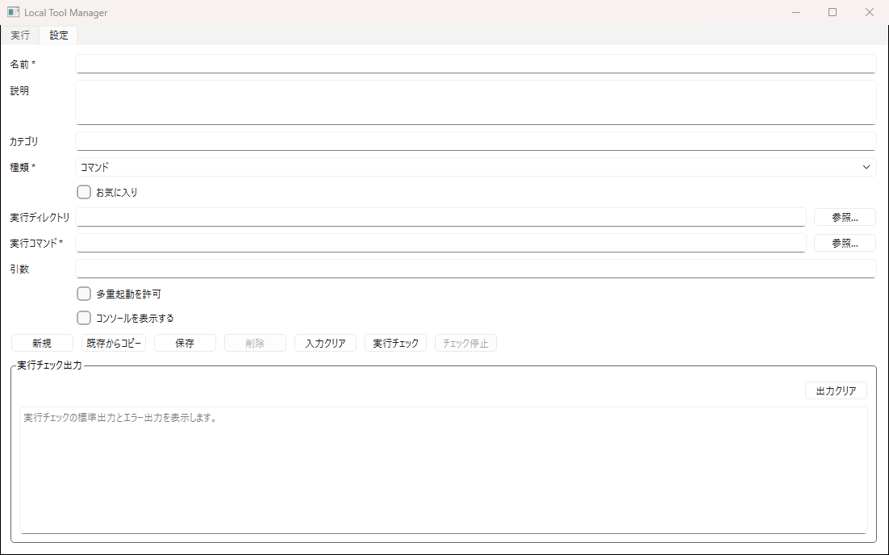
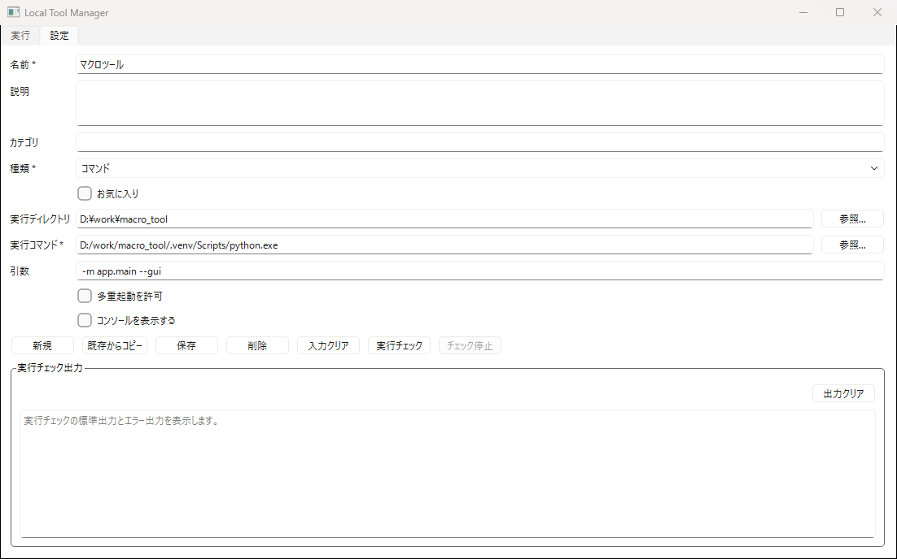
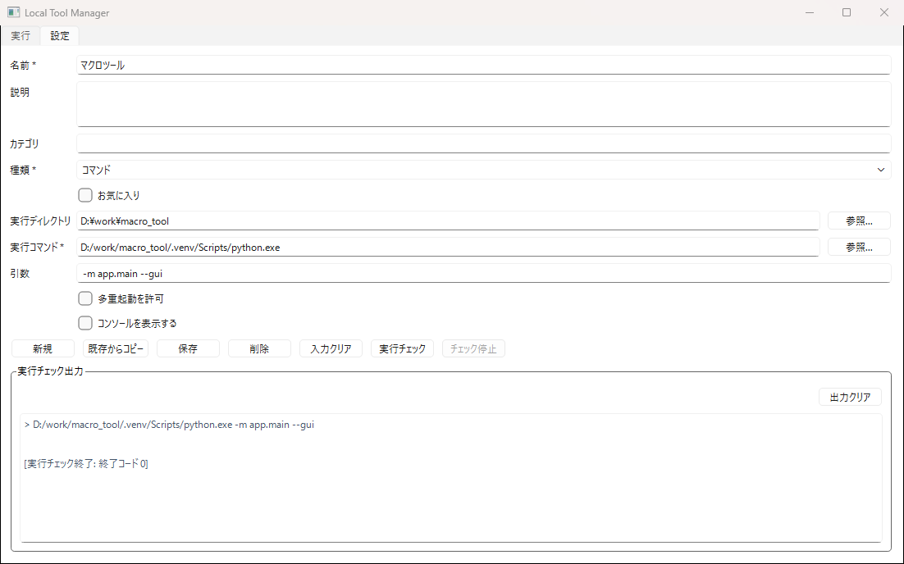

# Local Tool Manager 使い方

Local Tool Managerは、Pythonスクリプト、exe、bat/cmd、任意のコマンド、Webページを1つの一覧に登録して起動できるWindows向けアプリです。

## 1. 起動する

ダウンロードしたファイルを任意のフォルダーへ展開し、`LocalToolManager.exe`をダブルクリックします。

アプリを起動すると「実行」タブが表示されます。登録したツールの起動、停止、検索、絞り込みをこの画面から行えます。



> Windowsの警告が表示された場合は、配布元が購入したBOOTH商品であることを確認してから実行してください。

## 2. ツールを新規登録する

「設定」タブを開き、「新規」を押してから登録内容を入力します。



主な入力項目は次のとおりです。

- `名前`: 一覧に表示するツール名です。
- `説明`: 用途や注意事項を記録できます。
- `カテゴリ`: 実行タブでの検索や絞り込みに使用します。
- `種類`: アプリやスクリプトは「コマンド」、Webページは「URL」を選びます。
- `お気に入り`: よく使うツールの目印として設定します。

### コマンドを登録する場合

- `実行ディレクトリ`: ツールを実行するフォルダーです。相対パスでファイルを読むツールでは正しく設定してください。
- `実行コマンド`: `.exe`、`.py`、`.bat`、`.cmd`やPATH上のコマンドを指定します。「参照」からファイルを選ぶこともできます。
- `引数`: コマンドへ渡すオプションやファイルパスを入力します。
- `多重起動を許可`: 同じツールを同時に複数起動するときだけオンにします。
- `コンソールを表示する`: コマンドプロンプト画面が必要なツールでオンにします。

Pythonの仮想環境を指定する登録例です。



```text
実行ディレクトリ: D:\work\macro_tool
実行コマンド: D:\work\macro_tool\.venv\Scripts\python.exe
引数: -m app.main --gui
```

入力後に「保存」を押すと、実行タブの一覧へ追加されます。

### URLを登録する場合

種類で「URL」を選び、`http://`または`https://`で始まるURLを入力します。

URLに `{keyword}` のようなプレースホルダーを含めると、起動時に値を入力できます。入力した値はURL用に自動変換されます。

```text
https://www.google.com/search?q={keyword}
```

## 3. 保存前に実行チェックする

コマンドの設定中に「実行チェック」を押すと、保存前の内容で試しに起動できます。標準出力、エラーメッセージ、終了コードは画面下部の「実行チェック出力」に表示されます。



`[実行チェック終了: 終了コード 0]` と表示されれば、コマンドは正常に終了しています。チェックが終わらない場合は「チェック停止」で停止できます。

実行チェックによって、対象ツールが実際のファイルを作成・更新する場合があります。安全に試せる引数やデータを使用してください。

## 4. 登録したツールを使う

「実行」タブでは次の操作ができます。

- 起動: 対象行をダブルクリックします。右クリックメニューの「実行」も使用できます。
- 停止: コマンドを右クリックし、「停止」を選びます。URLは停止できません。
- 編集: 行を選択して画面上部の「編集」を押すか、右クリックメニューの「編集」を選びます。
- 並べ替え: 検索と絞り込みを解除した状態で行をドラッグします。
- 複製: 右クリックメニューの「複製」で、既存設定をもとに新しく登録できます。
- 削除: 右クリックメニューの「削除」を選び、確認画面で削除します。実行中のツールは削除できません。
- フォルダーを開く: コマンドを右クリックし、「実行ディレクトリを開く」を選びます。

検索欄では名前、説明、カテゴリを検索できます。カテゴリと状態の選択欄を使うと、登録数が増えても目的のツールを絞り込めます。

## 5. 既存の設定を流用する

設定タブの「既存からコピー」を押して登録済みツールを選ぶと、その内容を新規登録用のフォームへコピーできます。元の登録内容は変更されません。必要な箇所を直して「保存」してください。

## データの保存先

登録内容とログは、Windowsのユーザーデータフォルダーへ保存されます。

```text
%LOCALAPPDATA%\local_tool_manager\
├─ local_tool_manager.db
└─ local_tool_manager.log
```

アプリ本体を更新しても通常は登録内容が引き継がれます。登録内容をバックアップする場合は、アプリを終了してから上記フォルダーの`local_tool_manager.db`をコピーしてください。

## 困ったときは

- 起動しない: 実行コマンドと実行ディレクトリが存在するか確認してください。
- Pythonツールが起動しない: 使用する環境の`python.exe`を実行コマンドへ指定し、スクリプトやモジュールを引数へ指定してください。
- 引数に空白がある: ファイルパスなどをダブルクォート（`"`）で囲んでください。
- 「すでに実行中」と表示される: 多重起動が禁止されています。実行中のツールを停止するか、必要に応じて設定を変更してください。
- 詳細を確認したい: `%LOCALAPPDATA%\local_tool_manager\local_tool_manager.log`を確認してください。

## 現在の主な制限

- Windows 10/11向けです。
- URLを開いた後のブラウザは停止・管理しません。
- 管理者権限が必要なツールの起動や停止には対応していません。
- 本アプリの終了時に、本アプリから起動したツールは終了しません。
